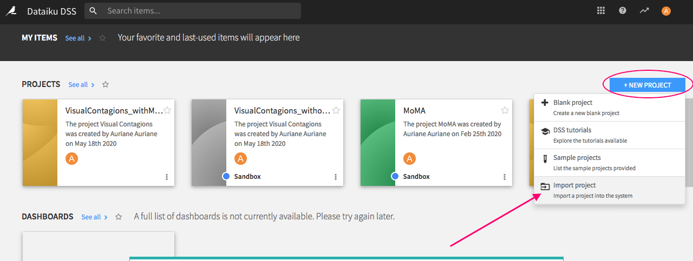
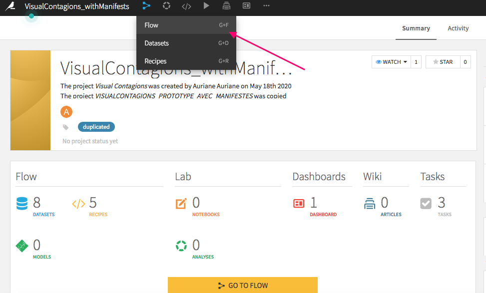
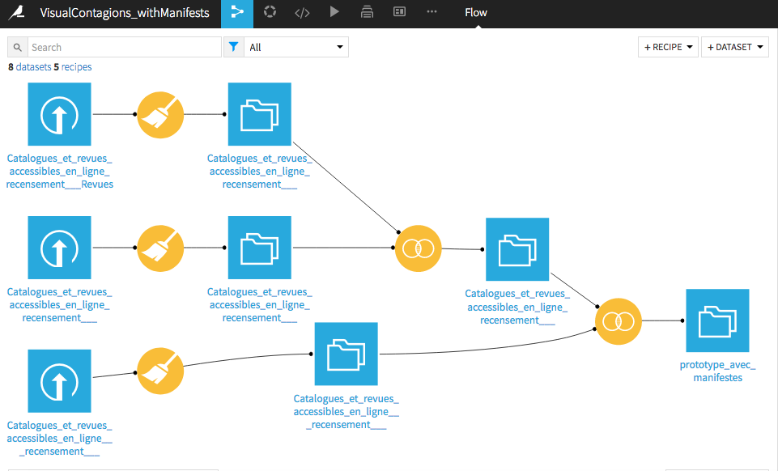
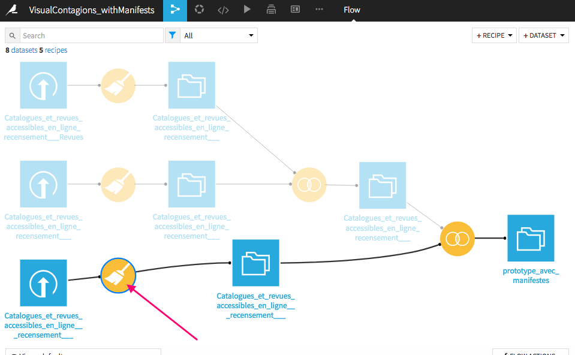
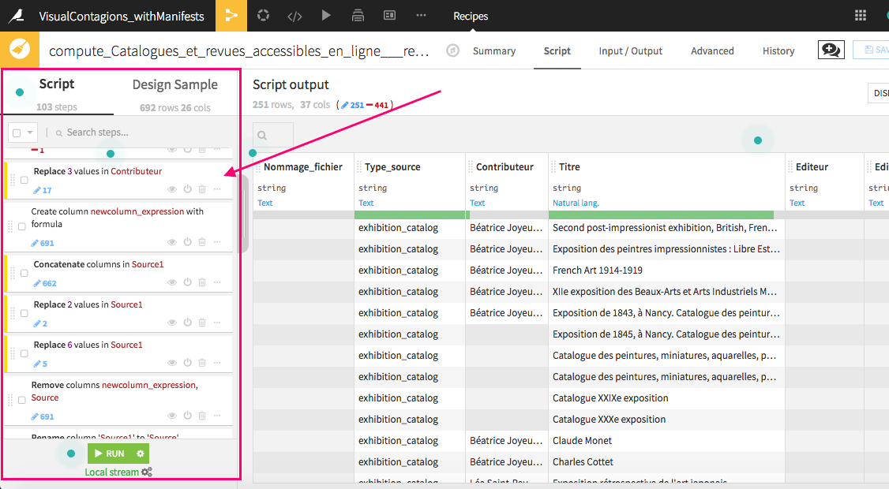
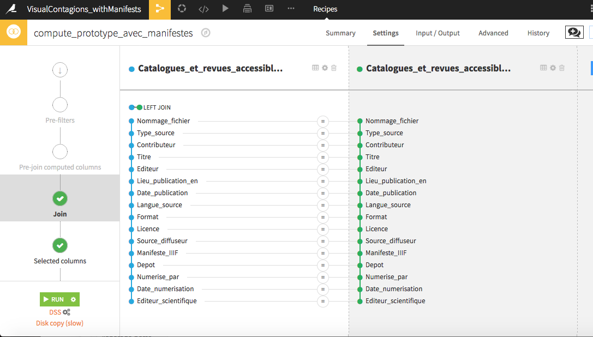

## Prototype CSV

### Presentation

This folder contains the first steps of my work : the realization of a prototype of CSV which lists exhibition catalogs and periodicals already available online.
This prototype must allow the collection of metadata concerning the resources.

It is made up of two tables. The first one contains documents for which there are no IIIF manifest and the second one lists those for which there is already a IIIF manifest.
There is a dual purpose concerning the first table: on the one hand, it must make it possible to generate IIIF manifests from the collected metadata ; on the other hand, some of these metadata (exhibition catalogs that are not present in BasArt) must allow to expand BasArt, the exhibition catalogs database of the Artl@s project.

The second table makes it possible to retrieve existing manifests in order to integrate them into the future portal of the VISUAL CONTAGIONS project. The purpose is also to expand BasArt with the catalogs that are not yet referenced there.

To carry out this work, I therefore had to select the fields necessary for BasArt and I integrated them into the table. I also had to check the composition of the IIIF manifests and I completed the prototype with what was missing.

### Folder 1: 1_DataPreparation-Dataiku

This folder contains the work I made with Dataiku.
I started with three CSV files, partially completed, but which did not include all the fields necessary for the project. Moreover, it was impossible to use them to automatically generate other documents with a single script because the structure of these files was different.
So I had to think about a model encompassing these three files (and including all the fields described above in the presentation part).

In order to avoid losing the data already entered in these three CSV files, I suggested cleaning this data and modifying the structure of the tables in Dataiku, before merging the structure of these three files.
I also chose to use this application software because each preparation of the dataset (with a "recipe") is documented by a script in which each step is recorded. Each step can be duplicated, moved, deactivated or deleted. This allowed me to go back easily to my work in order to modify a step. This was helpful because these were the early stages of the project.

Originally, we planned to make only one table including all the resources. But it was afterwards decided to separate these resources into two tables (with manifests and without manifests). This is why there are two Dataiku projects. The second was duplicated from the first. In the first case, it was necessary to select the resources (for the three CSV files) without manifest and to exclude the others, and we did the reverse in the second case.

#### Import Dataiku projects

It is possible to import these projects in Dataiku ("**VISUALCONTAGIONS_withManifests.zip**" and "**VISUALCONTAGIONS_withoutManifests.zip**").

**1.** You can download Dataiku [here](https://www.dataiku.com/product/get-started/).

**2.** Click on `New project` > `Import project`.

**3.** Then select one of the .zip files et click on the `Import` button.

**4.** You have now access to the project. If you click on the `Flow`, you can see all the steps realized.

**5.** If you click on the `Prepare` recipe, you can consult the script referencing all the modifications made to the first version of the CSV.

**6.** The `Join` recipe shows you how the dataset are joined.

### Folder 2: 2_FinalPrototype

The folder includes a sample of the two CSV files ("**1_PrototypeCSV_exhibCat-periodicals_withoutManifests.csv**" and "**2_PrototypeCSV_exhibCat-periodicals_withManifests.csv**").
The samples contain all the fully completed lines.
The whole documents can be downloaded from the README in this folder: "**3_CSVtoTEI** »(VISUAL_CONTAGIONS/3_CSVtoTEI/README.md). They are filled in by several members of the team of the project.

I collected metadata and filled some lines in order to make tests in the next stages of the project.

I also wrote a documentation which specifies how to fill in the tables ("**3_PrototypeCSV_Documentation**"). It is available in three formats: .docx, .odt and .pdf.