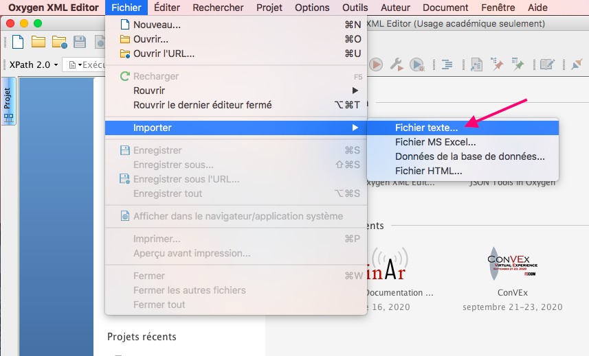
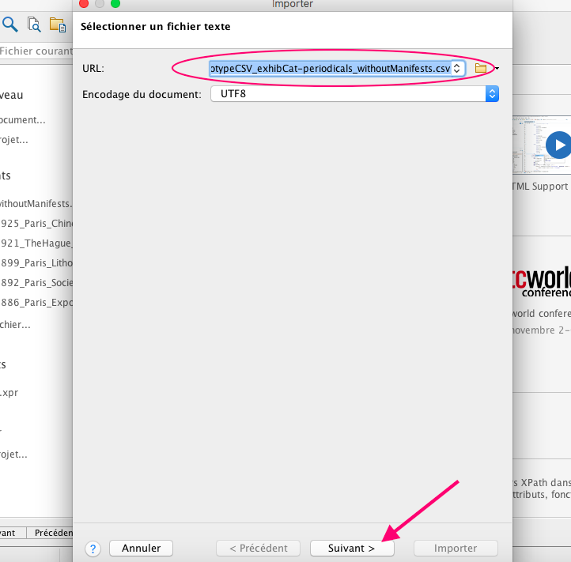
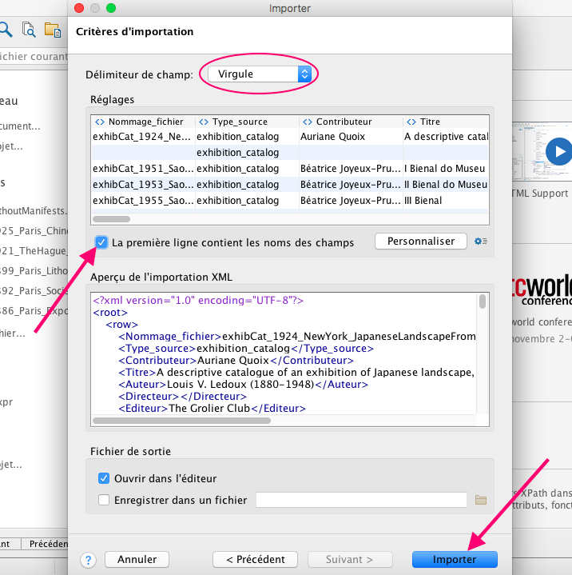
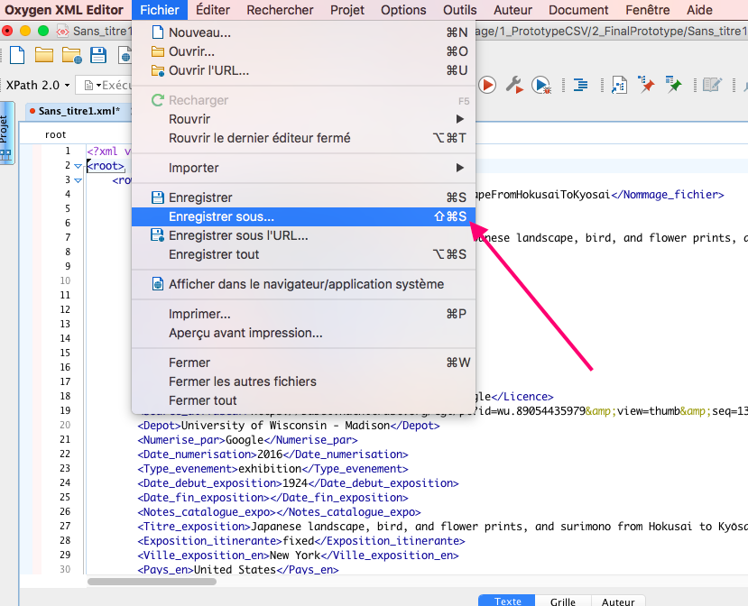
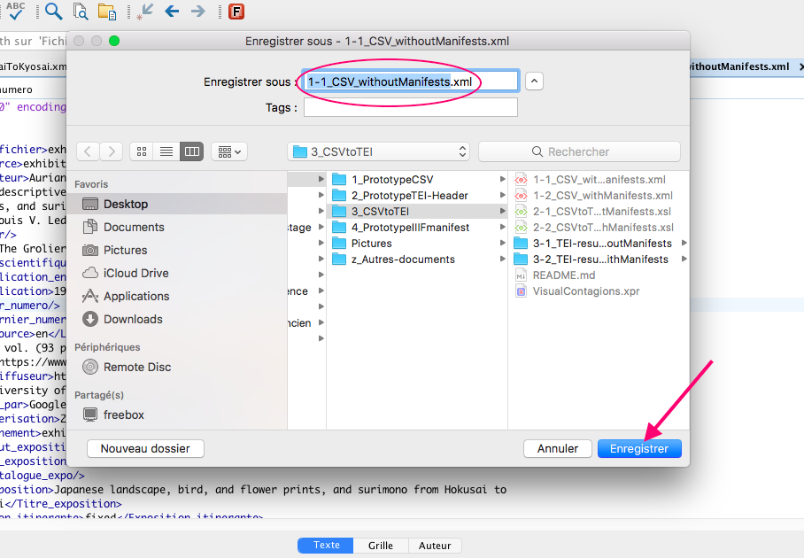
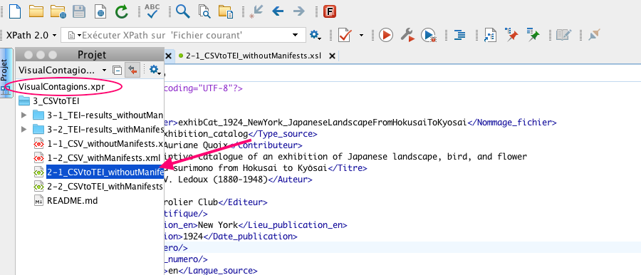
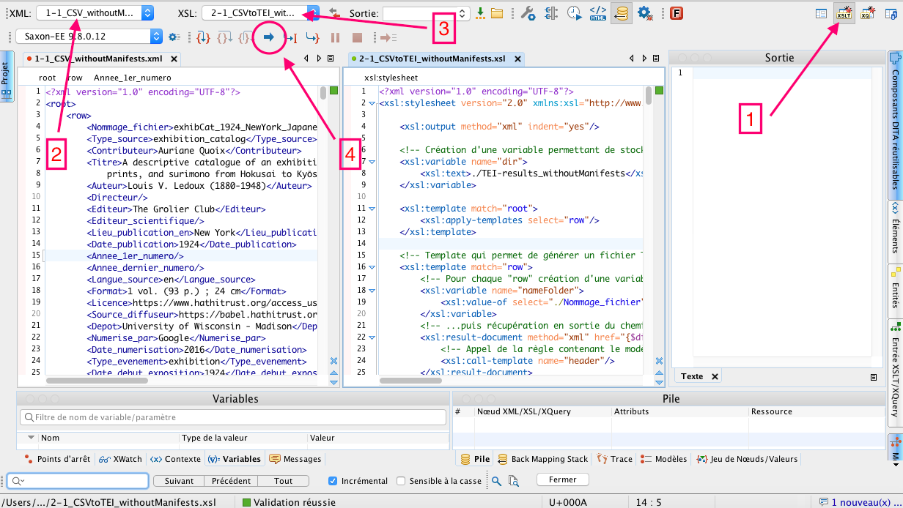

## CSV to TEI

## Step: Converting CSV files into XML-TEI headers

### Requirements

The conversion of CSV files into XML-TEI headers is carried out using Oxygen XML Editor. You can download it [here](https://www.oxygenxml.com/xml_editor/download_oxygenxml_editor.html).

### Dubstep 1: Import of the CSV files into Oxygen XML Editor

It is possible with Oxygen XML Editor to import text files as XML documents (it concerns txt or csv extensions).
So we will do this with the two spreadsheets published [here](https://docs.google.com/spreadsheets/d/e/2PACX-1vSNE-7ly0bDOiip7aGKQwX8gh0oxHegF4Ivk1AwHLw-uzMyxQUXkkvSDk-MfaEkYl50qZpjH1maOv-n/pub?gid=1979735129&single=true&output=csv) and [here](https://docs.google.com/spreadsheets/d/e/2PACX-1vSNE-7ly0bDOiip7aGKQwX8gh0oxHegF4Ivk1AwHLw-uzMyxQUXkkvSDk-MfaEkYl50qZpjH1maOv-n/pub?gid=1261081562&single=true&output=csv) (click on the links to download the two CSV files).

The first one concerns the resources without IIIF manifests and the second one concerns those for which it already exists a manifest.

After downloading the CSV files, you must open Oxygen XML Editor.

**1.** Go to `File` > `Import` > `Text File`.

**2.** In the dialog box, select the URL of the first CSV file downloaded (PrototypeCSV_exhibCat-periodicals - withoutManifests), click on `Open` and then on the `Next` button.

**3.** Now, the import criteria dialog box is displayed.
- Verify that the selected field delimiter for the import settings is `Comma`.
- Select the option `First row contains field names`.
- Click on the `Import` button.

**4.** The new XML document is opened in the editor.
Go to `File` > `Save` and give this name to the file: "**1-1_CSV_withoutManifests.xml**".

**You must follow the same procedure to import the second CSV file (PrototypeCSV_exhibCat-periodicals - withManifests) into Oxygen XML Editor.**

Once you get to **4.**, name it: "**1-2_CSV_withManifests.xml**".

### Dubstep 2: Generation of TEI headers with XSLT

**1.** Open the **2-1_CSVtoTEI_withoutManifests.xsl** file (VISUAL_CONTAGIONS/3_CSVtoTEI/2-1_CSVtoTEI_withoutManifests.xsl) in Oxygen. Or open the **VisualContagions.xpr** project (VISUAL_CONTAGIONS/VisualContagions.xpr) and click on **2-1_CSVtoTEI_withoutManifests.xsl** to open it.

**2.** Now the transformation can be launched.
- Open the XSLT Debugger perspective. For that, select the `XSLT Debugger` button in the top-right corner of the interface (or go to `Window` > `Open perspective` > `XSLT Debugger`). On the picture, it corresponds to the arrow number one.

- Select the XML file **1-1_CSV_withoutManifests.xml** (arrow number 2) and the XSL file **2-1_CSVtoTEI_withoutManifests.xsl** (arrow number 3).

- Click on the `run` button (arrow number 4).

The results are in the **3-1_TEI-results_withoutManifests** folder.

**3.** You can follow the same procedure to transform the other file.

- After opening them, select the XML file **1-2_CSV_withManifests.xml** and the XSL file **2-2_CSVtoTEI_withManifests.xsl** in the XSLT Debugger perspective.

- Click on the `run` button.

The results are in the **3-2_TEI-results_withManifests** folder.
