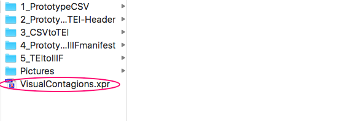
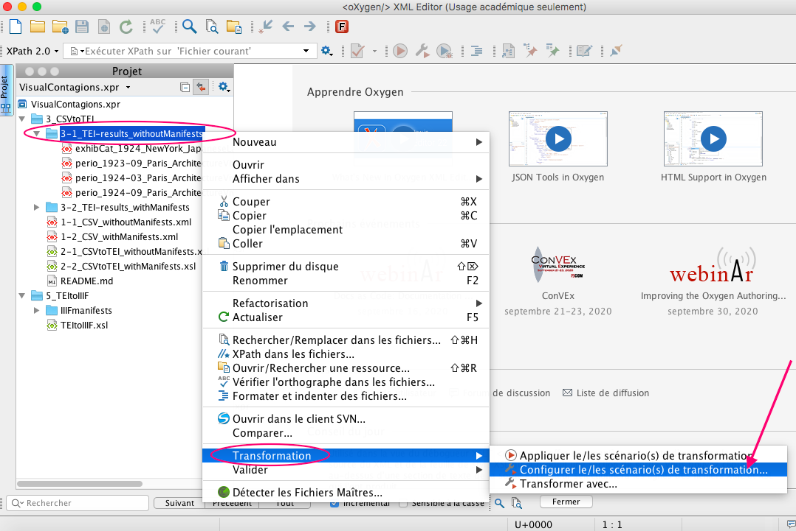
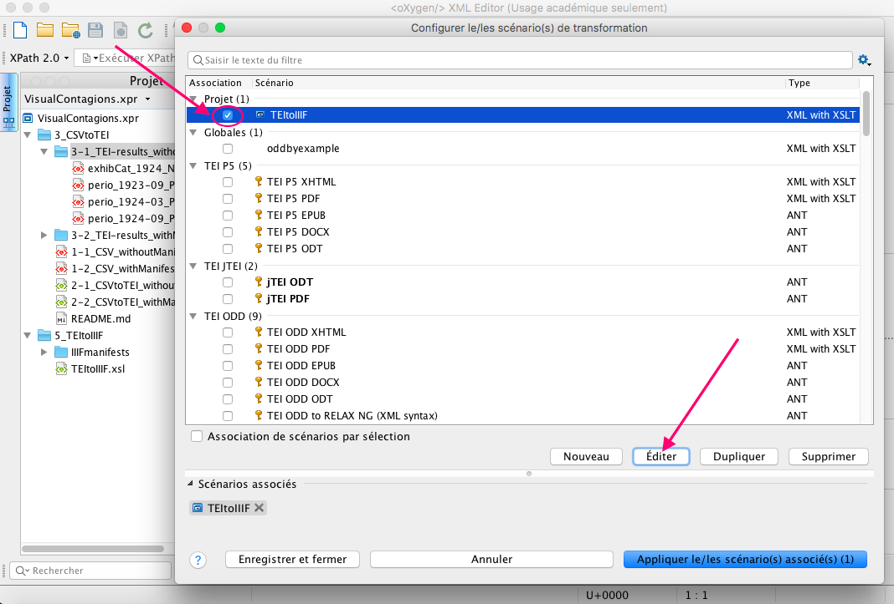
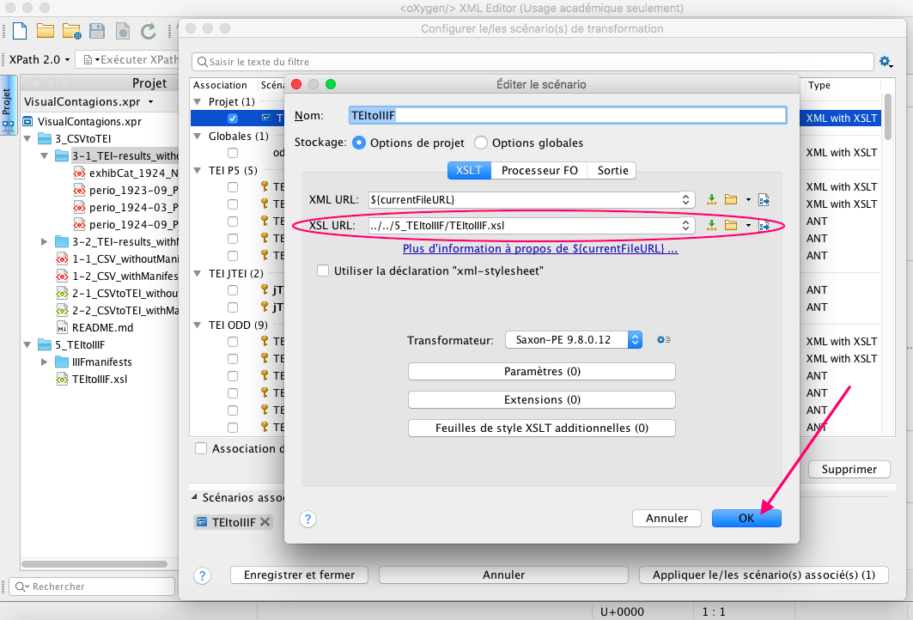
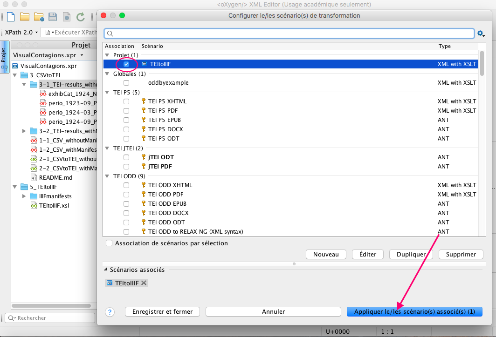
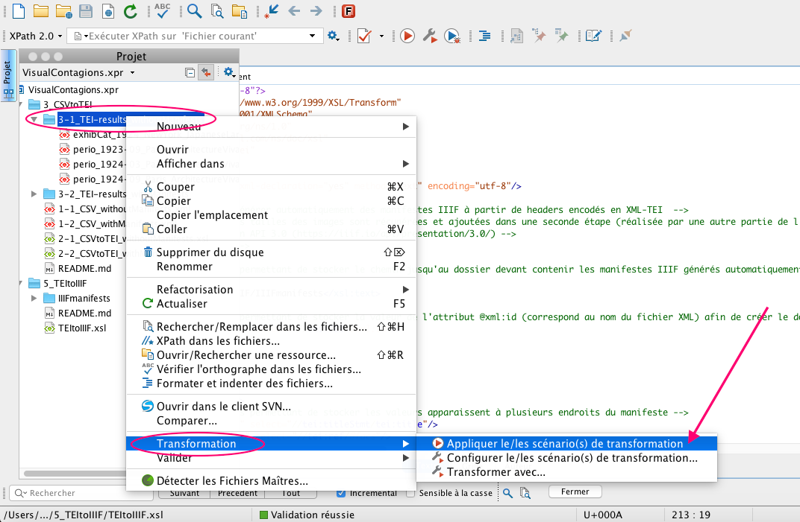

## TEI to IIIF manifests

## Step: Converting metadata files encoded in XML-TEI into IIIF manifests

### Requirements

The conversion of XML-TEI files into IIIF manifests (JSON-LD) is carried out using Oxygen XML Editor. You can download it [here](https://www.oxygenxml.com/xml_editor/download_oxygenxml_editor.html).

### Informations

This XSLT script generates manifests files conforming to the IIIF Manifest [Presentation API 3.0 specification](https://iiif.io/api/presentation/3.0/).
The generated files are complete except for the size of images (width and height properties) which will be added to the manifest in a second step (this step is carried out by another part of the team).
In the same way, each canvas will have to be repeated in order to obtain one canvas for each image composing the resource.

### Dubstep 1: Configure Transformation Scenario

**1.** Firstly, open the **VisualContagions.xpr** project (VISUAL_CONTAGIONS/VisualContagions.xpr) in Oxygen XML Editor.

**2.** Right click on the "**3-1_TEI-results_withoutManifests**" folder and select `Transformation`> `Configure Transformation Scenario(s)`.

**3.** This opens the Configure Transformation Scenario(s) Dialog Box.
Select the "**TEItoIIIF**" scenario and click on the `Edit`button.

**4.** Verify that the XSL URL is "**../../5_TEItoIIIF/TEItoIIIF.xsl**" and click on `OK`.

### Dubstep 2: Generation of IIIF manifests with XSLT

After configuring the transformation scenario, on the same dialog box (Configure Transformation Scenario(s)), you can click on `Apply associated`button.

Once the transformation scenario has been associated, all you have to do is to right click on the "**3-1_TEI-results_withoutManifests**" folder and select `Transformation`> `Applying Associated Transformation Scenarios`.

The results are in the **IIIFmanifests** folder.
